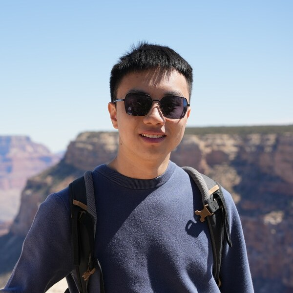

<!-- 

  

 -->

# Weizhou Wang

I am a PhD student in theoretical chemistry at the University of Chicago, advised by [Aaron R. Dinner](https://dinner-group.uchicago.edu/) and [Jonathan Weare](https://cims.nyu.edu/~weare/).

My research lies at the intersection of statistical mechanics, molecular simulation, and machine learning. I am interested in generative sampling methods for physical systems.

## Selected Research Code

- [GenerativeGibbsSamplingforPathIntegral](https://github.com/weizhouwangw/GenerativeGibbsSamplingforPathIntegral)  
  Code for generative Gibbs sampling for path-integral quantum statistics.  
  Paper: [arXiv:2601.20228](https://arxiv.org/abs/2601.20228)

- [GG-PA](https://github.com/weizhouwangw/GG-PA)  
  Code for composing diffusion priors with explicit physical context via generative Gibbs sampling.  
  Paper: [arXiv:2605.10642](https://arxiv.org/abs/2605.10642)

## Links

- Website: [weizhouwangw.github.io](https://weizhouwangw.github.io)
- Google Scholar: [OOckHoEAAAAJ](https://scholar.google.com/citations?user=OOckHoEAAAAJ&hl=en)
- ORCID: [0009-0004-6749-3003](https://orcid.org/0009-0004-6749-3003)
- Email: [weizhouwang@uchicago.edu](mailto:weizhouwang@uchicago.edu)
